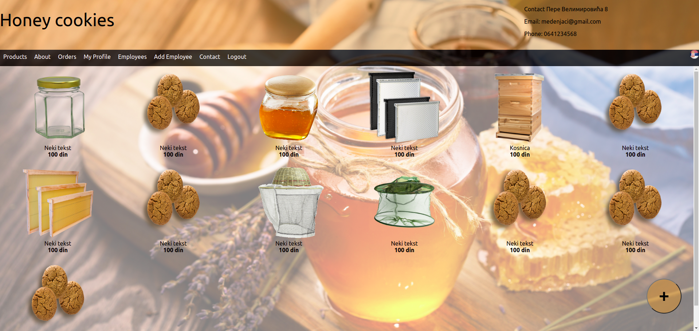
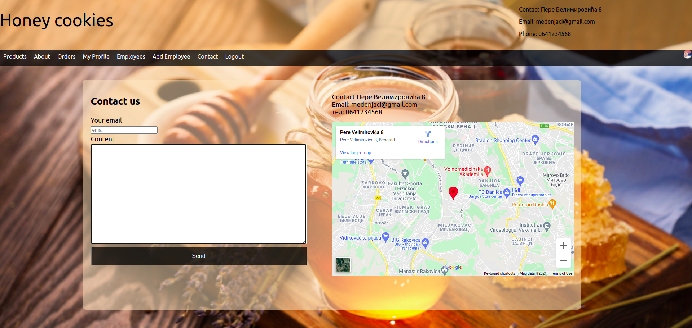

<!-- TABLE OF CONTENTS -->
<details>
  <summary>Table of Contents</summary>
  <ol>
    <li>
      <a href="#about-the-project">About The Project</a>
      <ul>
        <li><a href="#built-with">Built With</a></li>
      </ul>
    </li>
    <li>
      <a href="#getting-started">Getting Started</a>
      <ul>
        <li><a href="#prerequisites">Prerequisites</a></li>
        <li><a href="#installation">Installation</a></li>
      </ul>
    </li>
    <li><a href="#usage">Usage</a></li>
    
  </ol>
</details>


<!-- ABOUT THE PROJECT -->
## About The Project

School project built for faculty course <a href="https://www.etf.bg.ac.rs/en/fis/karton_predmeta/13M111PKI-2019#gsc.tab=0">User Interface Design</a>. Goal was to build web and mobile application for store which specializes in selling equipment for beekeepers and honey products. 

This store recognizes three user types:
<ul>
<li>Administrator: Manage sellers </li>
<li>Seller: Adds new products to shop and verify orders created by buyers</li>
<li>Buyer: Views products, adds them to basket and create orders</li>
 
<p align="right">(<a href="#top">back to top</a>)</p>


## Screen shots
<!-- PROJECT LOGO -->
<br />
<p>Home page</p>


<p>Contact</p>



### Built With
 
 Project was built using react and create-react-app toolchain.

* [React.js](https://reactjs.org/)
* [HTML](https://developer.mozilla.org/en-US/docs/Web/HTML)
* [CSS](https://developer.mozilla.org/en-US/docs/Web/CSS)

<p align="right">(<a href="#top">back to top</a>)</p>


<!-- GETTING STARTED -->
## Getting Started

To get a local copy of this project up and running follow these simple example steps.

### Prerequisites

First of you need to have [node](https://nodejs.org/en/). If you don't, install it from [here](https://nodejs.org/en/).


You can check if it already installed by typing following to your terminal.   
  ```sh
  node -v
  ```

### Installation

1. Clone the repo
   ```sh
   git clone https://github.com/bpavle/honey-store-web
   ```
2. Navigate to project directory
    ```sh
    cd honey-store-web
    ```
3. Install NPM packages
   ```sh
   npm install
   ```

<p align="right">(<a href="#top">back to top</a>)</p>


<!-- USAGE EXAMPLES -->
## Usage

As this is just frontend of application, you can try out all of the features just by creating fake accounts which will be kept in RAM until you stop the app.

Try logging in as admin with username: mail@mail.com, and password: password

From here you can create user account for your employees(sellers), add some products, their description, photo, price, and then log out and try to add those products to chart and place an order.

After that log back in as seller using seller account you created earlier and verify order you just placed.

<p align="right">(<a href="#top">back to top</a>)</p>


